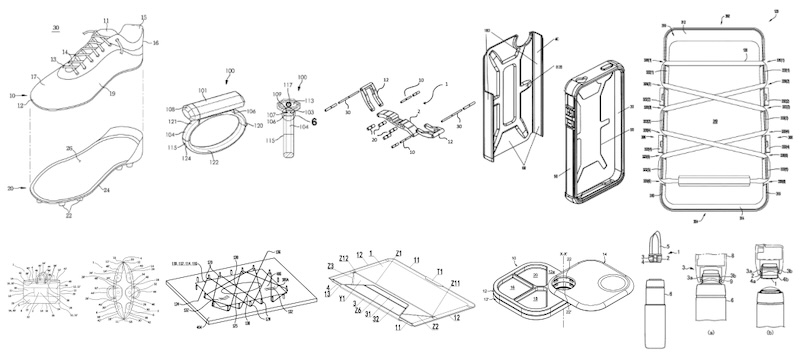

# OpenGazette

Python tools to work with the [USPTO weekly Patent Official Gazettes](https://developer.uspto.gov/product/patent-official-gazettes-listing).

An example use, is [the conversion](opengazette/gazette_to_csv.py) of a zipped HTML + GIF assets of the gazette directly to a zipped tabular CSV file.

Additional uses include extraction of the exemplary claims or corresponding drawings.

The repository includes some light-weight [example data](data/) and [documentation](docs/) to get started.

The [source](/opengazette) includes simple examples and stand alone command line programs.



---

This repository is an active project. Expect steady revisions and extensions, such as :

* extend HTML parsing to additional fields, such as [CPC classes](https://www.uspto.gov/web/patents/classification/cpc/html/cpc.html)
* better document specific fields, such as the identfier
* analysis for why using ```filed_by``` versus ```assigned_to```
* include some minimal testing using both subset and full gazette data
* note about the ```not_issued``` patents in the gazettes
* post-processing tools for formatting query results
* comparsion of methods to query exemplary claims
* tools to post-process examplary claims
* comparison of methods to query patent drawings
* additional features and functionality to add


